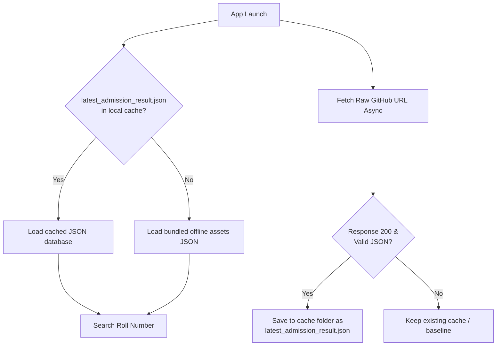

# MyDUET Admission Results Publishing Guide

This guide describes how to publish and update the **Undergraduate Admission Test Results** inside the MyDUET application.

---

## 1. System Architecture

The admission results module uses a **Hybrid Dynamic Fetching Strategy** to deliver updates instantly to all installed apps without requiring a new app release on the Google Play Store:



- **Remote URL:** `https://raw.githubusercontent.com/saidul-07/MyDUET-Android-App/main/app/src/main/assets/results/latest_admission_result.json`
- **Offline Fallback Asset:** `results/2026/admission_result_2026.json`

---

## 2. Prerequisites for Generating Results

To generate the results JSON file from the scanned PDF sheets, you must run the extraction script on a **Windows machine** (as it uses the native high-speed Windows OCR APIs).

### Install Python Dependencies
Run the following command in your terminal/PowerShell:
```bash
pip install pymupdf winocr pillow requests
```

---

## 3. Step-by-Step Update Guide (For Next Year)

When next year's results (e.g., **2027**) are published on the official DUET admission portal:

### Step 1: Create the Year Folder and Download PDFs
1. Navigate to `app/src/main/assets/results/`.
2. Create a new subfolder named after the year (e.g., `2027`).
3. Download the result PDFs for all departments and place them inside the `2027/` folder.
   - *Example filenames:* `CE.pdf`, `CSE.pdf`, `EEE.pdf`, `ME.pdf`, `ChE_Waiting_List.pdf`, etc.

### Step 2: Run the OCR Generation Script
Open a terminal in `app/src/main/assets/results/` and run the script:
```bash
python generate_result_json.py 2027
```
The script will perform the following actions:
- Render each PDF page at high resolution (**3.0x scale**).
- Preprocess the images (grayscale and contrast-boosted) to eliminate faint ink or smudges.
- Execute Windows OCR and parse columns dynamically depending on page layouts (Selected vs Waiting).
- Reconstruct lines, filter metadata, deduplicate records, and assign sequential waitlist merit numbers.
- **Outputs generated:**
  - `app/src/main/assets/results/2027/admission_result_2027.json` (Local backup)
  - `app/src/main/assets/results/latest_admission_result.json` (Online reference)

### Step 3: Commit and Push to GitHub
Commit and push the new files to the `main` branch of your GitHub repository:
```bash
git add app/src/main/assets/results/
git commit -m "Update admission results for 2027"
git push origin main
```
**That's it!** All installed user applications will automatically download the new `latest_admission_result.json` on launch and display the 2027 results.

---

## 4. Troubleshooting & Layout Adjustments

If DUET modifies the design/column layout of their result sheets next year, you may need to adjust the column boundaries inside the `extract_candidates_from_page` function of [generate_result_json.py](file:///c:/Users/Sayedul%20Islam/Desktop/MyDUET/app/src/main/assets/results/generate_result_json.py).

### How to Adjust Coordinates (at 3.0x Scale)
Inside the script, column classification is done based on the horizontal center coordinate (`cx`) of the recognized words:

```python
# Selected List Bounds (Default Layout)
# Column 1 (SL):        cx < 150
# Column 2 (Roll):      150 <= cx < 360
# Column 3 (Name):      360 <= cx < 780
# Column 4 (Father's):  780 <= cx < 1230

# Waiting List Bounds (Includes extra Merit Position column)
# Column 1 (SL/Merit):  cx < 225
# Column 2 (Roll):      225 <= cx < 420
# Column 3 (Name):      420 <= cx < 870
# Column 4 (Father's):  870 <= cx < 1320
```

To see the exact coordinates of words on a page for layout adjustments, run a debug query:
```python
import fitz, winocr
doc = fitz.open("path/to/your/pdf.pdf")
pix = doc[0].get_pixmap(matrix=fitz.Matrix(3.0, 3.0))
# Perform winocr.recognize_pil_sync on image and print w["bounding_rect"]
```
Adjust the column bounds in [generate_result_json.py](file:///c:/Users/Sayedul%20Islam/Desktop/MyDUET/app/src/main/assets/results/generate_result_json.py) to match the new coordinates.
