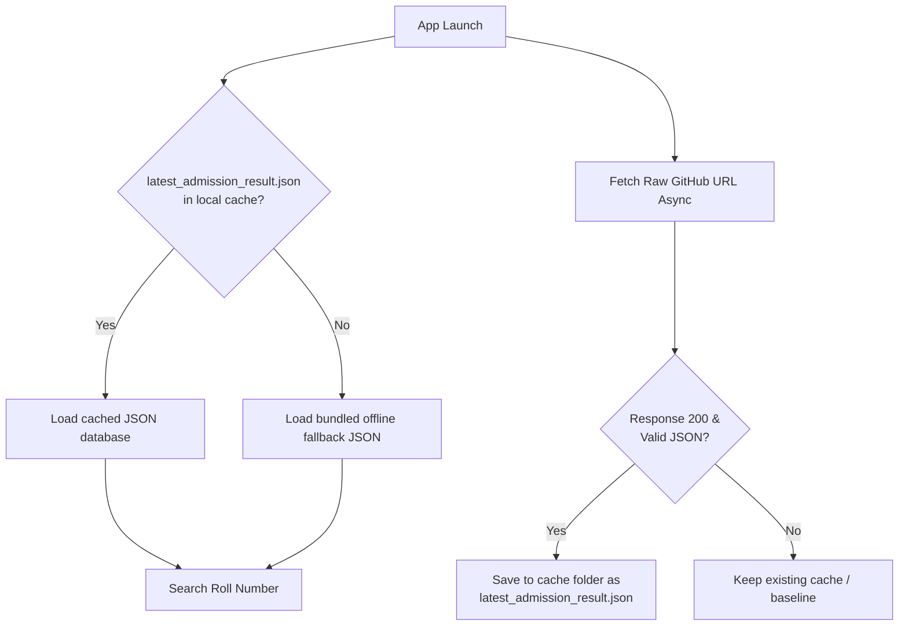
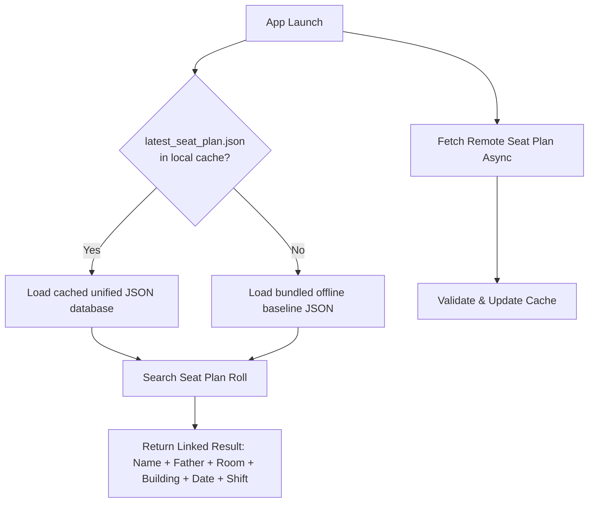

# MyDUET Data Publishing Guide (Admission Results & Seat Plans)

This document describes how to update, generate, and publish the **Admission Results** and **Seat Plan** databases inside the MyDUET application.

---

## 1. System Architecture

Both modules utilize a **Hybrid Dynamic Fetching Strategy**. The app attempts to download the latest databases from GitHub asynchronously at launch. If successful, it caches the JSON databases locally. Otherwise, it falls back to the bundled baseline assets:

````carousel

<!-- slide -->

````

### Remote GitHub URLs:
- **Admission Results:** `https://raw.githubusercontent.com/saidul-07/MyDUET-Android-App/main/app/src/main/assets/results/latest_admission_result.json`
- **Seat Plans (Unified):** `https://raw.githubusercontent.com/saidul-07/MyDUET-Android-App/main/app/src/main/assets/seat_plan/latest_seat_plan.json`

---

## 2. Environment Setup & Prerequisites

To parse the official DUET admission PDFs, you need a Python environment with the following dependencies installed:

```bash
pip install pymupdf winocr pillow requests
```

> [!IMPORTANT]
> The **Admission Results Generator** uses the native **Windows OCR API** (`winocr` library) for 100% accuracy on scanned image PDFs. You MUST run the Results Generator script on a **Windows machine**. The Seat Plan parser only requires text extraction and can run on any OS.

---

## 3. Admission Results Update Guide

When next year's results (e.g. `2027`) are published:

### Step 1: Place PDF Files
1. Navigate to `app/src/main/assets/results/`.
2. Create a folder named after the year (e.g. `2027/`).
3. Download and save all department result PDFs inside `results/2027/`.

### Step 2: Run the Result Generator
Open a terminal in `app/src/main/assets/results/` and run:
```bash
python generate_result_json.py 2027
```
This script will render the PDFs at `3.0x` scale, run Windows OCR, reconstruct rows, and output:
- `results/2027/admission_result_2027.json` (Baseline fallback)
- `results/latest_admission_result.json` (Online reference copy)

### Step 3: Troubleshooting Coordinates
If the result sheet table layout changes, update the horizontal bounds (`cx`) inside the `extract_candidates_from_page` method of [generate_result_json.py](file:///c:/Users/Sayedul%20Islam/Desktop/MyDUET/app/src/main/assets/results/generate_result_json.py):
```python
# Selected List Bounds (Default)
# Column 1 (SL): cx < 150  |  Column 2 (Roll): 150 <= cx < 360
# Column 3 (Name): 360 <= cx < 780  |  Column 4 (Father's): 780 <= cx < 1230

# Waiting List Bounds (Extra Merit Column)
# Column 1 (Merit): cx < 225  |  Column 2 (Roll): 225 <= cx < 420
# Column 3 (Name): 420 <= cx < 870  |  Column 4 (Father's): 870 <= cx < 1320
```

---

## 4. Seat Plans & Candidates Update Guide

When next year's seat plan and candidate lists are published:

### Step 1: Place PDF Files
1. Save the official seat plan PDF inside `app/src/main/assets/seat_plan/2027/`.
2. Save the candidate lists (one PDF per department) inside `app/src/main/assets/valid_candidates/`.

### Step 2: Run the Generation & Merging Workflow
Open a terminal in `app/src/main/assets/seat_plan/` and run the following three commands in order:
```bash
# 1. Extract valid candidate details
python generate_candidates_json.py 2027

# 2. Extract seat plan room ranges
python generate_seat_plan_json.py 2027

# 3. Merge candidates with seat plans and clean up temporary assets
python merge_seat_plan_candidates.py 2027
```
This process will match each of the candidates to their corresponding exam rooms/buildings and output:
- `seat_plan/2027/seat_plan_2027.json` (Unified fallback database)
- `seat_plan/latest_seat_plan.json` (Online reference copy)

### Step 3: Troubleshooting Coordinates
- **Candidate Name/Father Split:** [generate_candidates_json.py](file:///c:/Users/Sayedul%20Islam/Desktop/MyDUET/app/src/main/assets/seat_plan/generate_candidates_json.py) splits Name from Father's Name by detecting the largest horizontal gap in a row. It uses a default threshold of `15` pixels. If the gap decreases, lower it to `12` in the script.
- **Seat Plan Dash Overlaps:** [generate_seat_plan_json.py](file:///c:/Users/Sayedul%20Islam/Desktop/MyDUET/app/src/main/assets/seat_plan/generate_seat_plan_json.py) allows a horizontal overlap (down to `-10` pixels) to match adjacent roll numbers separated by an en-dash. Adjust this if rolls fail to match.

---

## 5. Publishing Changes

Once the JSON databases are generated, push the assets to the `main` branch:
```bash
git add app/src/main/assets/
git commit -m "Update admission results and seat plans for 2027"
git push origin main
```
The mobile apps will download the updates automatically on startup.
